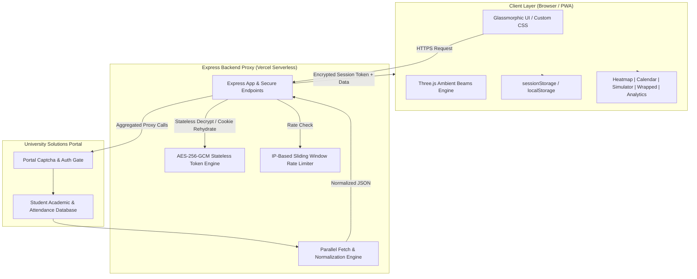

# 🎓 NMAMIT Attendance Tracker

<p align="center">
  
  
  
  
  
  
  
</p>

---

## 📖 Overview

**NMAMIT Attendance Tracker** is a next-generation, high-performance academic intelligence dashboard designed specifically for students of **NMAMIT / Nitte Deemed to be University**. It interfaces securely with the University Solutions student portal (`studentportal.universitysolutions.in`) to transform raw, tabular attendance records into rich, actionable visualizations, predictive simulations, and semester analytics.

Crafted with an obsessive focus on **cyber security, speed, and design elegance**, the application features a zero-credential-storage stateless architecture, GitHub-style attendance matrices, a real-time "What-If" simulator, and a Spotify-style semester recap.

---

## 🌟 Core Features

### 📅 1. Interactive Calendar & Timetable Matrix
- **Day-by-Day Inspection:** Navigate across months to inspect class-by-class attendance records with detailed subject codes, timestamps, and status indicators (`Present`, `Absent`, `Holiday`).
- **Client-Side Session Caching:** Accelerates repeat visits using structured `sessionStorage` caching (`att_month_YYYY-MM`), reducing network overhead by up to 80%.

### 🟩 2. GitHub-Style Contribution Heatmap
- **Semester-Calibrated Grid:** Automatically maps attendance across a 22-week span beginning from the semester start (August).
- **Streak & Consistency Analytics:** Computes continuous attendance streaks, current streak velocity, and active attendance density.
- **Progressive Batch Ingestion:** Fetches historical months asynchronously in parallel pairs with intelligent date boundaries, skipping non-instructional Sundays and future dates.

### 🎯 3. What-If Attendance Simulator & Margin Calculator
- **Bunk Budget Calculator:** Instantly calculates the exact number of classes you can afford to miss while staying safely above the mandatory 85% or 75% thresholds.
- **Recovery Class Planner:** Determines precisely how many consecutive classes you must attend to recover from a low attendance percentage.
- **Interactive Sandbox:** Adjust sliders for individual subjects to project future semester attendance outcomes before making decisions.

### 🚨 4. Danger Radar & Analytics
- **Early-Warning System:** Flags subjects nearing or below critical attendance limits (75% / 85%) with visual severity indicators.
- **Day-of-Week DNA:** Visualizes attendance patterns by weekday (Monday–Saturday) to identify behavioral trends.
- **Subject Leaderboard:** Ranks subjects from highest to lowest attendance with individual margin indicators.

### 🏆 5. Attendance Wrapped (Semester Story Recap)
- **Spotify-Style 9:16 Story Card:** Generates a personalized, downloadable recap card showcasing your attendance tier, total hours attended, top subject, and streak records.
- **Archetype Persona Badges:** Classifies attendance behavior into fun student personas (*"Attendance Overachiever"*, *"Calculated Gambler"*, *"Danger Zone Navigator"*).
- **One-Tap Share & Download:** Native HTML5 Canvas rendering for instant sharing on WhatsApp, Instagram, and LinkedIn.

### 📱 6. Progressive Web App (PWA)
- **Zero-Friction Installation:** Fully installable as a standalone app on iOS, Android, macOS, and Windows.
- **Offline-First Resilience:** Integrated Service Worker caches application assets, themes, and WebGL modules for instant boot times.
- **Standalone Auto-Detection:** Automatically hides redundant install prompts when running inside native app wrappers or standalone display mode.

### 🎨 7. Three.js WebGL Dynamic Beams Background
- Custom hardware-accelerated WebGL ambient light beams and particle physics responding dynamically to user interaction.

---

## 🏗️ System Architecture



---

## 🛡️ Cyber Security Engineering

As a project engineered by students from the **Department of Cyber Security**, security and student privacy are baked into every layer of the architecture:

### 1. Stateless AES-256-GCM Session Encryption
- **No Server Database / Zero Credential Storage:** Student passwords and credentials are **never stored** on any database or server.
- **Cold-Start Resilience:** Sessions are encrypted into a stateless, authenticated cryptographic token (`sess_...`) using **AES-256-GCM** (Galois/Counter Mode) with an initialization vector (IV) and authentication tag. Any serverless instance across Vercel regions can authenticate requests without needing a shared session database (Redis/Memcached).

### 2. Ephemeral Captcha Token Bridging
- To bridge the multi-step captcha authentication flow across disparate serverless Lambda invocations, the portal's `PHPSESSID` cookie is encrypted inside an authenticated captcha token (`cap_...`) with a strict **5-minute expiration window**.

### 3. Comprehensive Security Headers
The server enforces strict HTTP security headers:
- `X-Content-Type-Options: nosniff` — Prevents MIME-type sniffing attacks.
- `X-Frame-Options: SAMEORIGIN` — Mitigates clickjacking attempts.
- `Referrer-Policy: strict-origin-when-cross-origin` — Protects referral metadata.
- `Permissions-Policy: geolocation=(), microphone=(), camera=()` — Disables unneeded browser APIs.

### 4. Rate Limiting & Abuse Prevention
- In-memory rate limiting restricts abusive login attempts (15 requests per 15-minute window per IP) to protect upstream portal servers from brute-force floods.

### 5. Context-Aware XSS Sanitization
- All dynamic data rendered into the DOM passes through robust HTML escaping routines to prevent cross-site scripting (XSS) via injected student names or course descriptions.

---

## 🧮 Mathematical Formulations

### 1. Bunk Budget Calculation (Target Attendance $T$)
To find how many additional classes ($B$) can be skipped while maintaining attendance $\ge T$ (where $T = 0.85$ or $0.75$):

$$\text{Current Percentage } P = \frac{A}{C} \times 100$$

$$\text{Maximum Bunks } B = \left\lfloor \frac{A - (T \times C)}{T} \right\rfloor$$

*Where $A$ is classes attended and $C$ is total classes conducted.*

---

### 2. Recovery Classes Required
If attendance falls below the target threshold ($P < T$), the number of consecutive attended classes ($R$) required to recover is:

$$\text{Recovery Classes } R = \left\lceil \frac{(T \times C) - A}{1 - T} \right\rceil$$

---

## 📁 Repository Structure

```
├── public/
│   ├── css/
│   │   └── style.css            # Responsive dark-mode styling & glassmorphism
│   ├── js/
│   │   ├── api.js               # Client API gateway, session & error handling
│   │   ├── app.js               # Core application controller & lifecycle
│   │   ├── beams.js             # Three.js WebGL dynamic background engine
│   │   ├── calendar.js          # Interactive calendar & timetable view
│   │   ├── clickspark.js        # Micro-interaction particle animations
│   │   ├── dropdown.js          # Custom accessible select components
│   │   ├── heatmap.js           # August-calibrated contribution matrix & streaks
│   │   ├── simulator.js         # What-If projection & target calculators
│   │   ├── summary.js           # Danger radar, DNA charts, and subject grids
│   │   ├── wrapped.js           # Spotify-style 9:16 semester recap generator
│   │   └── libs/
│   │       └── three.core.js    # Optimized Three.js WebGL bundle
│   ├── index.html               # Semantic HTML5 single-page application
│   ├── manifest.json            # PWA configuration & Web App Manifest
│   └── service-worker.js        # Asset caching & offline worker (v5)
├── server.js                    # Express backend proxy & crypto token engine
├── vercel.json                  # Vercel serverless deployment routing
└── package.json                 # Project dependencies & scripts
```

---

## 🔌 API Endpoint Reference

| Method | Route | Description |
|---|---|---|
| `GET` | `/api/captcha` | Fetches a new base64 captcha image and returns an encrypted `captchaToken`. |
| `POST` | `/api/login` | Authenticates against the university portal using mobile number, password, and captcha. Returns an encrypted `sessionId`. |
| `GET` | `/api/attendance-summary` | Retrieves normalized semester subject totals, percentages, and attendance health. |
| `GET` | `/api/attendance-month?year=YYYY&month=MM` | Fetches day-by-day timetable and attendance logs for a specific calendar month. |
| `POST` | `/api/logout` | Clears the session state and invalidates tokens. |
| `GET` | `/api/session-check` | Validates session longevity and token authenticity. |

---

## 🚀 Local Development

### Prerequisites
- **Node.js**: v18.0.0 or higher
- **npm**: v9.0.0 or higher

### Quick Start
```bash
# 1. Clone the repository
git clone https://github.com/Sujal-GS/NMAMIT-Attendance-Tracker.git
cd NMAMIT-Attendance-Tracker

# 2. Install dependencies
npm install

# 3. Start local development server
npm run dev

# 4. Open browser
# Navigate to http://localhost:3050
```

---

## ☁️ Deployment to Vercel

The application is architected natively for **Vercel Serverless Functions**:

1. Fork or push this repository to GitHub.
2. Import the project into [Vercel](https://vercel.com).
3. Set Framework Preset to **Other** (Root directory is default `./`).
4. Set Build Command to empty/default and Output Directory to `.` or leave empty.
5. Deploy! Vercel automatically deploys `server.js` using `@vercel/node`.

---

## 👨‍💻 Engineering Team

<div align="center">
  <table>
    <tr>
      <td align="center" width="50%">
        <strong>Sujal G S</strong><br />
        <em>Dept. of Cyber Security</em><br />
        NMAM Institute of Technology, Nitte<br /><br />
        <a href="https://www.linkedin.com/in/sujal-g-s/">
          
        </a>
      </td>
      <td align="center" width="50%">
        <strong>Lakshminarayanan P S</strong><br />
        <em>Dept. of Cyber Security</em><br />
        NMAM Institute of Technology, Nitte<br /><br />
        <a href="https://www.linkedin.com/in/lakshminarayanan-p-s/">
          
        </a>
      </td>
    </tr>
  </table>
</div>

---

## 📄 License

This project is licensed under the **MIT License** — see the [LICENSE](LICENSE) file for details.

